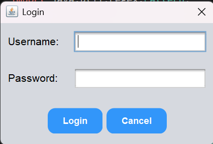
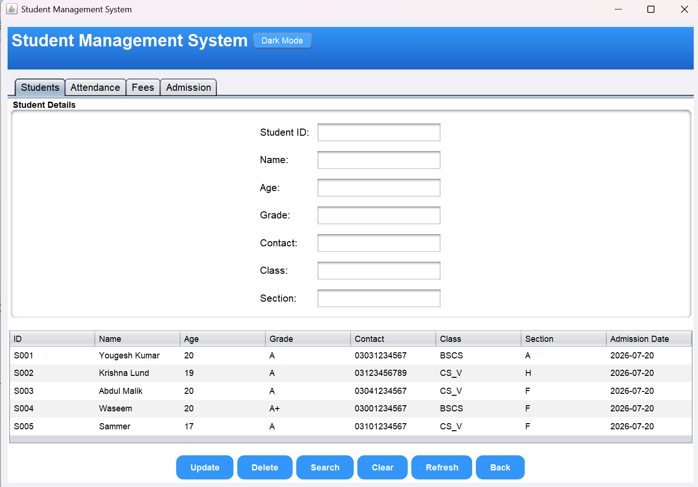
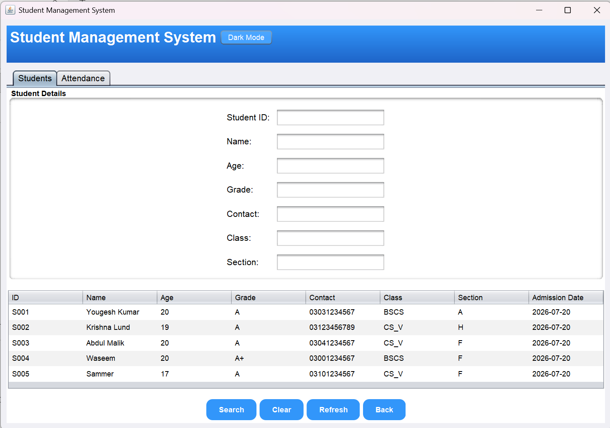
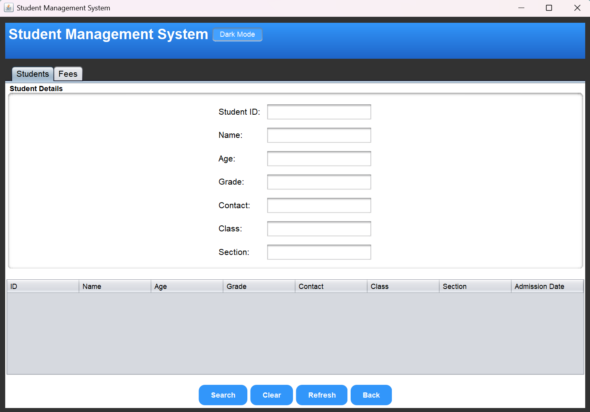

# 🎓 Student Management System

A desktop-based **Student Management System** developed using **Java Swing**, **JDBC**, and **MySQL**. The application provides **role-based authentication** for **Admin**, **Teacher**, and **Student** users, enabling efficient management of student records, attendance, fees, and reports through an intuitive graphical user interface.

---

## ✨ Features

### 🔐 Authentication
- Secure Role-Based Authentication (Admin, Teacher & Student)

### 🛡️ Admin Dashboard
- Manage Student Records
- Manage Fee Records
- Generate Reports

### 👨‍🏫 Teacher Dashboard
- View Student Records
- Mark Student Attendance
- View Attendance Reports

### 👨‍🎓 Student Dashboard
- View Personal Information
- View Attendance Record
- View Fee Details

### 📚 Core Features
- 📝 Student Management (Create, Read, Update, Delete & Search)
- 📅 Attendance Management
- 💰 Fee Management
- 📊 Report Generation
- 🌙 Dark Mode
- 🗄️ MySQL Database Integration

---

## 🛠️ Technologies Used

- Java
- Java Swing
- JDBC (Java Database Connectivity)
- MySQL
- Object-Oriented Programming (OOP)
- Git
- GitHub

---

## 📂 Project Structure

```text
Student_System_project/
│
├── screenshots/
│   ├── login.png
│   ├── admin-dashboard.png
│   ├── teacher-dashboard.png
│   └── student-dashboard.png
│
├── src/
│   ├── Main.java
│   ├── StudentManagementSystem.java
│   ├── student_management1.sql
│   └── META-INF/
│
├── mysql-connector-java-8.0.28.jar
├── .gitignore
└── README.md
```

---

## 📋 Requirements

- Java JDK 21 (or later)
- MySQL Server 8.0+
- VS Code or IntelliJ IDEA
- MySQL Connector/J 8.0.28

---

## ⚙️ Installation

### 1. Clone the repository

```bash
git clone https://github.com/Eshwarlal-125/Student-Management-System-Java.git
```

### 2. Open the project

Open the project in **VS Code** or **IntelliJ IDEA**.

### 3. Import the database

Import the **student_management1.sql** file into your MySQL Server.

### 4. Configure the database

Update the MySQL username and password inside `StudentManagementSystem.java` if required.

### 5. Add MySQL Connector

Ensure that `mysql-connector-java-8.0.28.jar` is added to the project's classpath.

### 6. Run the application

Run the **StudentManagementSystem.java** file to launch the application.

---

## 📸 Screenshots

### 🔐 Login Screen


### 🛡️ Admin Dashboard


### 👨‍🏫 Teacher Dashboard


### 👨‍🎓 Student Dashboard


---

## 🚀 Future Improvements

- Export Reports to PDF
- Export Reports to Excel
- Email Notifications
- Improved User Interface (UI)
- Dashboard Analytics
- User Profile Management
- Web-Based Version using Spring Boot & React

---

## 📄 License

This project is intended for educational and learning purposes.

---

## 👨‍💻 Author

**Eshwar Lal**

GitHub: [Eshwar Lal](https://github.com/Eshwarlal-125)

---

## ⭐ Support

If you found this project helpful, please consider giving it a **⭐ Star** on GitHub.

It motivates me to build and share more open-source projects.

---

**Thank you for visiting this repository! 😊**